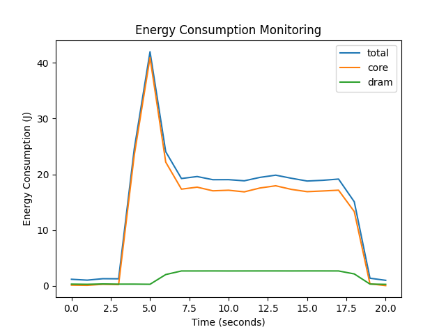

# MO632 - Exame 1 - Energy Consumption Monitoring

The applications used for matrix multiplication are based on the following work:

[Walkthrough to matrix multiplication using OpenMP](https://medium.com/tech-vision/parallel-matrix-multiplication-c-parallel-processing-5e3aadb36f27)

[Repository](https://github.com/roshanmadhushanka/Parallel-Matrix-Multiply)

## First scenario - Sequential
Raw: measurements-sequential.pkl
Energy monitoring results: measurements-plot-serial.png
Time: sequential-time.txt

Plot:

## Second scenario - Optimized Parallel
Raw: measurements-optimized.pkl
Energy monitoring results: measurements-plot-optimized-parallel.png
Time: optimized-time.txt

Plot:

